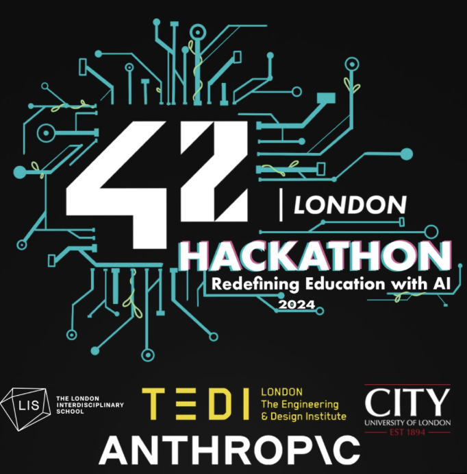

#  **AI for All Hackathon at 42 London - Mind Craft**



*As part of this event, I also had the honor of designing the logo for the **42 London Hackathon**, symbolizing innovation and education.*

This project was created as part of the **AI for All Hackathon at 42 London (February 23-26)**, where participants explored the potential of AI in revolutionizing education. The event brought together students from 42 London, LIS: The London Interdisciplinary School, City, University of London, and The Engineering & Design Institute London (TEDI-London). Leveraging Anthropic's Claude and mentorship from industry experts, this project is a product of collaboration, creativity, and a shared vision for the future of learning.

---

# **Mind Craft 🧠 : An AI-Powered Personalised Learning Tool**

Mind Craft is an interactive, AI-powered learning tool designed to personalize education for every user. Inspired by the creativity and flexibility of games like Minecraft, this mobile-first app lets learners explore topics visually, build their knowledge interactively, and craft a unique learning journey tailored to their interests, passions, and goals.


## **Features**

### 🌟 Core Functionality
- **Hexagonal Web Design**: A visually dynamic layout where each hexagon represents a topic or skill node. Users can tap to explore topics, zoom in on details, and expand their learning web.
- **AI-Generated Lessons**: Each topic opens an AI-curated "interactive textbook" with content tailored to the user's level, style, and interests.
- **Gamified Learning**: Complete tasks to unlock new hexagons, earn rewards like 'knowledge points,' and watch your learning web grow.
- **Chatbot Mentor**: Integrated with Claude AI (powered by Anthropic), the chatbot acts as a mentor, answering questions, explaining concepts, and guiding learners step-by-step.

### 📱 Mobile-First Design
- **One-Handed Navigation**: Optimized for seamless interaction on mobile devices.
- **Interactive UI**: Smooth gestures like swipe, pinch-to-zoom, and tap for an intuitive user experience.
- **Offline Mode**: Download lessons and continue learning even without an internet connection.

### 🛠️ Built With
- **Frontend**: A demo built using Figma to showcase the visual design and user flow.
- **Backend**: The chatbot was fully functional and developed in Python, leveraging [Streamlit](https://streamlit.io/) for the user interface and [Anthropic’s Claude](https://www.anthropic.com/) for AI-driven learning content.
- **Hosting**: Cloud-based deployment for fast and secure access.

---

## **How to Use**
1. Clone this repository:
   ```bash
   git clone https://github.com/pandashaly/mind-craft.git
   ```
2. Install dependencies:
   ```bash
   pip install -r requirements.txt
   ```
3. Add your [Anthropic API Key](https://www.anthropic.com/) in the app's sidebar settings.
4. Run the app:
   ```bash
   streamlit run app.py
   ```
5. Open the app in your browser and start crafting your personalized learning journey!

## **License**
This project is licensed under the MIT License. See the [LICENSE](LICENSE) file for details.

## **Acknowledgments**
- **AI for All Hackathon, 42 London**: Thank you to 42 London, LIS, TEDI-London, City University, and Anthropic for organizing and mentoring this groundbreaking event.
- [Streamlit](https://streamlit.io/) for providing an amazing framework to build interactive UIs.
- [Anthropic](https://www.anthropic.com/) for powering the AI behind Mind Craft.
- The open-source community for continuous inspiration and support.
